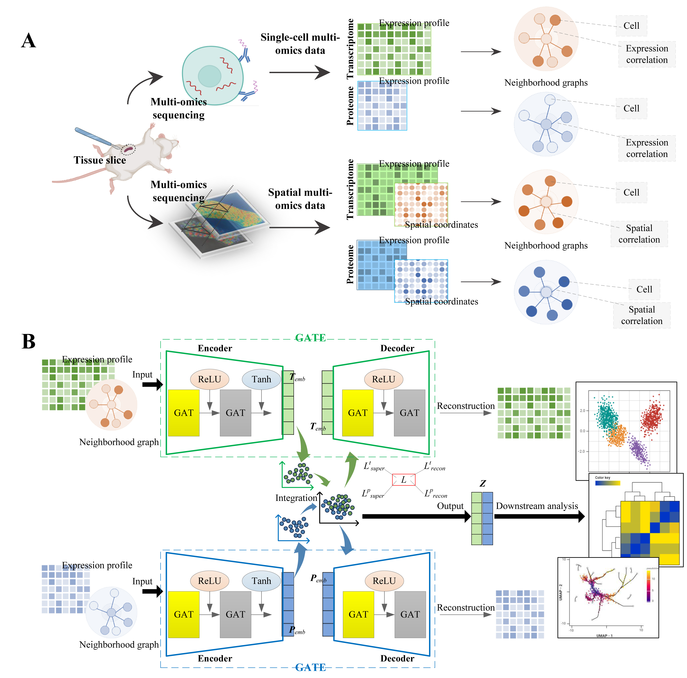

# Single-cell multi-omics and spatial multi-omics data integration via dual-path graph attention auto-encoder
## Introduction
Single-cell multi-omics data integration enables joint analysis of the resolution at single-cell level to provide 
comprehensive and accurate understanding of complex biological systems, while spatial multi-omics data integration is 
benefit to the exploration of cell spatial heterogeneity to facilitate more diversified downstream analyses. Existing 
methods are mainly designed for single-cell multi-omics data with little consideration on spatial information, and 
still have the room for performance improvement. A reliable multi-omics data integration method that can be applied to 
both single-cell and spatially resolved data is necessary and significant. We propose a single-cell multi-omics and 
spatial multi-omics data integration method based on dual-path graph attention auto-encoder (SSGATE). It can construct 
neighborhood graphs based on single-cell expression data and spatial information respectively, and perform 
self-supervised learning for data integration through the graph attention auto-encoders from two paths. SSGATE is 
applied to data integration of transcriptomics and proteomics, including single-cell and spatially resolved data of 
various tissues from different sequencing technologies. SSGATE shows better performance and stronger robustness than 
competitive methods and facilitates downstream analysis.

## Schematic Diagram

<div style="text-align: center;">
    
</div>

Figure: A. Neighborhood graph construction for single-cell multi-omics and spatial multi-omics data. 

Figure: B. Dual-path graph attention auto-encoder for multi-omics data integration.


## Quick Start

### Download the GitHub Repository
[Download](https://github.com/Linliu-Bioinf/SSGATE/archive/refs/heads/main.zip) this GitHub repository, and extract the contents into a folder.

### Data Description
We provide the datasets used in this study, which are stored in the BGI cloud disk.
[Link](https://bgipan.genomics.cn/#/link/vkxFIxtLWYRBXeHgHwlW)
Extract password is :nrEB
## Install and use it by Git
```bash
### Python enviroment constructed by Conda
conda create -n SSGATE python=3.8
conda activate SSGATE
git clone https://github.com/Linliu-Bioinf/SSGATE.git
cd SSGATE
python setup.py install

pip install -r requirements.txt
```


## Install and use it by STOmics Cloud Platform
We recommend using [STOmics Cloud Platform](https://cloud.stomics.tech/) to access and use it.
Users can use the public image of the STOmics Cloud Platform: `SSGATE`. The dependency files related to 
running `SSGATE` have been configured.

## Parameter Explanation
### Step 1:Neighborhood network construction
Before running SSGATE for multi-omics joint feature analysis, you must use the XX function to construct a neighbor 
network for a single omics data (transcriptome or proteome).

    adata = Cal_Nbrs_Net(adata, 
                         feat='X_pca', 
                         rad_cutoff=None, 
                         k_cutoff=None, 
                         model='Radius', 
                         verbose=True):

The parameters of  `Cal_Nbrs_Net` are:
- `adata`: The adata file (H5AD format) that need to be smoothed.
- `feat`: Controling the gradient of Gaussian curve.
- `rad_cutoff`: The a-value of the Gaussian kernel function, which is used to control the height of the Gaussian curve.
- `k_cutoff`: The b-value of the Gaussian kernel function, which is used to control the centre of the Gaussian curve.
- `model`: Number of principal components for calculating neighborhoods. 
- `verbose`: Number of nearest neighbors for computing kernel bandwidth.

return value:
- `adata`: The updated AnnData object, containing the calculated neighboring network information, is stored in uns['nbrs_net'].

### Step 2:Network pruning
This function is used to prune the adjacency network calculated by the `Cal_Nbrs_Net` function, ensuring that each edge 
only connects cells within the same cell population. After pruning, the updated adjacency network will be stored in 
the uns attribute of the AnnData object.

    adata = prune_net(adata)

return value:
- `adata`: The updated AnnData object, containing the pruned neighbor network information, is stored in uns['nbrs_net'].

### Step 3:Training
This function is used to prune the adjacency network calculated by the `Cal_Nbrs_Net` function, ensuring that each edge 
only connects cells within the same cell population. After pruning, the updated adjacency network will be stored in 
the uns attribute of the AnnData object.

    adata_st, adata_sp = ssmi.train(adata_st, 
                                    adata_sp, 
                                    hidden_dims1 = 128, 
                                    hidden_dims2 = 128, 
                                    out_dims = 30, 
                                    cluster_update_epoch = 20, 
                                    epochs_init = 50, 
                                    n_epochs=300, 
                                    lr=0.001,
                                    save_reconstrction=False, 
                                    sigma = 0.1, 
                                    device = "cuda:0", 
                                    feat1 = "PCA")
The parameters of  `train` are:
- `adata_st`: An AnnData object containing transcriptomics data.
- `adata_sp`: AnnData object containing proteomics data.
- `hidden_dims1`: Hidden layer dimensions for the first dataset in the model.
- `hidden_dims2`: Hidden layer dimensions for the second dataset in the model.
- `out_dims`: The dimensions of the model output embeddings.
- `cluster_update_epoch`: The interval between updating cluster labels.
- `epochs_init`: Number of epochs in the initial training phase.
- `n_epochs`: The total number of training rounds.
- `lr`: Learning rate.
- `key_added`: The key under which the embed result is stored.
- `gradient_clipping`: Gradient clipping threshold.
- `weight_decay`: Weight decay coefficient.
- `verbose`: Controls the output of training process information.
- `random_seed`: Random seed to ensure reproducibility.
- `save_loss`: Whether to save training loss.
- `save_reconstrction`: Whether to save the reconstruction results.
- `sigma`: The weight of the triplet loss in the loss function.
- `margin`: Margin of triplet loss.
- `device`: The training device (GPU or CPU).
- `feat1`: Features used by the first dataset.
- `feat2`: Features used by the second dataset.

## Tutorial
We provide a basic tutorial on using SSGATE (Tutorial_of_SSGATE.ipynb).

## Citation
If you use `SSGATE` in your work, please cite it.
> **Single-cell multi-omics and spatial multi-omics data integration via dual-path graph attention auto-encoder**
>
> Tongxuan Lv, Yong Zhang, Junlin Liu, Qiang Kang, Lin Liu
> 
> _bioRxiv_ 2024 June 04. doi: [https://doi.org/10.1101/2024.06.03.597266](https://doi.org/10.1101/2024.06.03.597266).


## Contact
Any questions or suggestions on SSGATE are welcomed! Please report it on issues, 
or contact Lin Liu (liulin4@genomics.cn).
